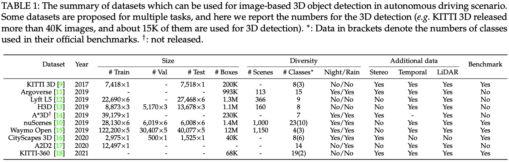

<div align="center">

# 3D Object Detection from Images for Autonomous Driving: A Survey

[Xinzhu Ma](https://scholar.google.com/citations?user=8PuKa_8AAAAJ), [Wanli Ouyang](https://scholar.google.com/citations?user=pw_0Z_UAAAAJ&hl=zh-CN), [Andrea Simonelli](https://scholar.google.com/citations?user=wK2I1ZsAAAAJ&hl=zh-CN&oi=ao), [Elisa Ricci](https://scholar.google.com/citations?user=xf1T870AAAAJ&hl=zh-CN&oi=ao)

### [Introduction](#introduction) | [Datasets](#datasets) | [Taxonomies](#taxonomies) | [Detectors](#detectors) | [Benchmarks](#benchmarks)

</div>

## Introduction

This is the official repository of [''3D  Object Detection from Images for Autonomous Drving: A Survey''](https://arxiv.org/pdf/2202.02980.pdf), a comprehensive survey of recent progress in deep learning methods for image-based 3D object detection. In this paper, we introduce the [[datasets]](#datasets) which can be used for this task, propose two [[taxonomies]](#taxonomies) to better organize the existing methods, and summarize the image-based 3D [[detectors]](#detectors) in both coarse (framework) level and fine (component) level. Besides, we also introduce the auxiliary data commonly used in the existing methods, and provide [[benchmarks]](#benchmarks) according to them. Finally, we discuss the relevant issues and potential reseach directions in this field.

Besides, this repo will be continuously maintained, and feel free to [contact me](mailto:xinzhu.ma@sydney.edu.au) if you have new methods to add or any suggestions!

## Datasets

#### Summary of the Datasets

<p align="center">  </p>

#### Resources of the Datasets

- KITTI-3D [[Paper (CVPR'12)]](http://www.cvlibs.net/publications/Geiger2012CVPR.pdf) [[Paper (IJRR'13)]](https://www.mrt.kit.edu/z/publ/download/2013/GeigerAl2013IJRR.pdf) [[Homepage]](http://www.cvlibs.net/datasets/kitti/) [[Data]](http://www.cvlibs.net/datasets/kitti/eval_object.php?obj_benchmark=3d) [[Benchmark]](http://www.cvlibs.net/datasets/kitti/eval_object.php?obj_benchmark=3d)
- Argoverse [[Paper (CVPR'19)]](https://openaccess.thecvf.com/content_CVPR_2019/papers/Chang_Argoverse_3D_Tracking_and_Forecasting_With_Rich_Maps_CVPR_2019_paper.pdf) [[Paper (NeurIPS'21)]](https://datasets-benchmarks-proceedings.neurips.cc/paper/2021/file/4734ba6f3de83d861c3176a6273cac6d-Paper-round2.pdf) [[Homepage]](https://www.argoverse.org/index.html) [[Data]](https://www.argoverse.org/data.html#download-link)
- Lyft L5 [[Homepage]](https://level-5.global/) [[Data]](https://level-5.global/download/) 
- H3D [[Paper (ICRA'19)]](https://arxiv.org/pdf/1903.01568.pdf) [[Data]](https://usa.honda-ri.com//H3D)
- A\*3D [[Paper (ICRA'20)]](https://arxiv.org/pdf/1909.07541.pdf) [[Homepage]](https://github.com/I2RDL2/ASTAR-3D)
- nuScenes [[Paper (CVPR'20)]](https://arxiv.org/abs/1903.11027.pdf) [[Homepage]](https://www.nuscenes.org/) [[Data]](https://www.nuscenes.org/nuscenes#download) [[Benchmark]](https://www.nuscenes.org/object-detection?externalData=all&mapData=all&modalities=Camera)
- Waymo Open [[Paper (CVPR'20)]](https://arxiv.org/abs/1912.04838.pdf) [[Homepage]](https://waymo.com/open/) [[Data]](https://waymo.com/open/download/) [[Benchmark]](https://waymo.com/open/challenges/2020/3d-detection/)
- CityScapes-3D [[Paper (CVPR'20 Workshop)]](https://arxiv.org/pdf/2006.07864.pdf) [[Homepage]](https://www.cityscapes-dataset.com/) [[Data]](https://www.cityscapes-dataset.com/downloads/) [[Benchmark]](https://www.cityscapes-dataset.com/benchmarks/#3d-vehicle-detection-task)
- A2D2 [[Paper (arXiv)]](https://arxiv.org/pdf/2004.06320.pdf) [[Homepage]](https://www.a2d2.audi/a2d2/en.html) [[Data]](https://www.a2d2.audi/a2d2/en/download.html)
- KITTI-360 [[Paper (arXiv)]](https://arxiv.org/abs/2109.13410.pdf) [[Homepage]](http://www.cvlibs.net/datasets/kitti-360/) [[Data]](http://www.cvlibs.net/datasets/kitti-360/download.php) [[Benchmark]](http://www.cvlibs.net/datasets/kitti-360/leaderboard_scene_understanding.php?task=box3d)

#### Others 

- [[Key-points annotations]](https://github.com/zongdai/AutoShape) generated by [[AutoShape]](https://arxiv.org/pdf/2108.11127.pdf) for KITTI-3D
- [[Mask, depth, and part annotations]](https://github.com/detectRecog/ZoomNet) generated by [[ZoomNet]](https://arxiv.org/pdf/2003.00529.pdf) for KITTI-3D
- [[Mask and disparity annoataions]](https://github.com/zju3dv/disprcnn) generated by [[Disp R-CNN]](https://arxiv.org/pdf/2004.03572.pdf) for KITTI-3D
- [[Depth maps]](https://github.com/xinzhuma/patchnet) for KITTI-3D pre-trained by [[DORN]](https://arxiv.org/pdf/1806.02446.pdf) (processed version can be found in [[this repo]](https://github.com/xinzhuma/patchnet))
- [[Pre-trained backbones (DLA34&V2-99)]](https://github.com/TRI-ML/dd3d) provided by [[DD3D]](https://arxiv.org/pdf/2108.06417.pdf)

## Taxonomies

To facilitate both the systematic analysis of current approaches and a fair comparison in performance for future works, we propose two novel taxonomies to categorize existing methods, *i.e.* in terms of their adopted ***frameworks*** and of the used ***input data***. Here we show the outline of the proposed taxonomies, and please refer to [our paper](https://arxiv.org/pdf/2202.02980.pdf) for more details.

```
taxonomies
  │──by framework
  │    ├──methods based on 2D features [result lifting]
  │    └──methods based on 2D features
  |         ├──feature lifting
  │         └──data lifting
  └──by input data
       ├──without auxiliday data (standard setting)
       ├──with auxiliday data in training phase
       |    ├──CAD models
       |    ├──LiDAR signals
       |    ├──additional training data
       |    └──...
       ├──with auxiliday data in training&testing phases
       |    ├──temporal sequences
       |    ├──stereo pairs
       |    └──...
       └──others (semi/self-supervised settings)  
```


## Detectors

This part collects the images-based 3D detectors, and you can choose to check these works [[by venue]](docs/methods_by_venue.md) or  [[by input data]](docs/methods_by_input.md).

## Benchmarks

We also maintain the commonly used benchmarks to help the researchers get relevant information quickly.  At present, the [[KITTI-3D benchmark]](docs/kitti.md) and the [[nuScenes benchmark]](docs/nuScenes.md) are avaliable in this repo. 

## Citation

If you find our work useful in your research, please consider citing:

    @article{3dodi,
      title = {3D object detection from images for autonomous driving: A survey},
      author = {Ma, Xinzhu and Ouyang, Wanli and Simonelli, Andrea and Ricci, Elisa},
      year = {2022},
      journal = {arXiv preprint arXiv:2202.02980}
    }

## Updates

See [[this document]](docs/change_logs.md) for the logs of update
