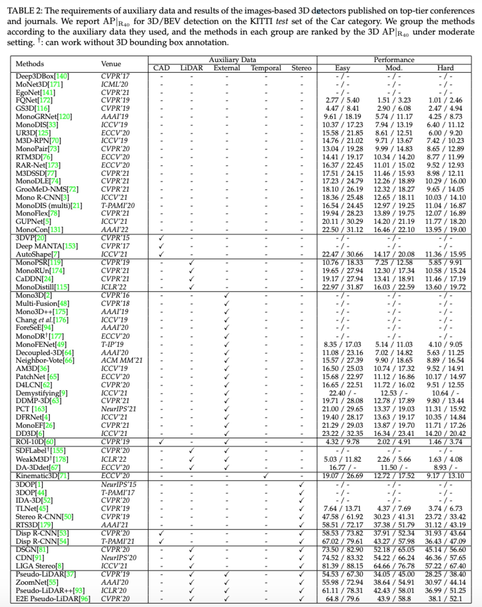

## KITTI-3D Benchmarks

We benchmark the image-based 3D detectors in the KITTI-3D dataset with AP40 metric. Because there are some methods apply the KITTI-Depth dataset as their auxiliary training set, which may lead to a unfair and unreliable comparison on the KITTI-3D *validation* set, we only present the results, ranked by the moderate setting, on the KITTI-3D *testing* set. The following benchmarks are organized by the auxiliary data used in the methods for a fair conmparison. You can refer to the [[summary]](#summary) or the [[detailed benchmarks]](#detailed benchmarks) in this page, and the offical benchmark can found in [[here]](http://www.cvlibs.net/datasets/kitti/eval_object.php?obj_benchmark=3d).

## Summary

The following figure shows the summary of the methods which published on the top-tier conferences and jounrals until ICLR'22.

  

## Detailed Benchmarks

This part benchmarks the image-based 3D detecors publish on all venues based on the input data, and will be continuesly maintained.

#### Standard Setting 

|      | Venue | Easy | Moderate\* | Hard |
| ---- | :---: | :--: | :------: | :--: |
| [MonoCon](https://arxiv.org/pdf/2112.04628.pdf) | AAAI'22 | 22.50 | 16.46 |13.95|
| [MonoJSG](https://arxiv.org/pdf/2203.08563.pdf) | CVPR'22 | 22.69 | 16.14 |13.64|
| [GUPNet](https://arxiv.org/pdf/2107.13931.pdf) | ICCV'21 | 20.11 | 14.20 |11.77|
| [MonoFlex](https://arxiv.org/pdf/2104.02323.pdf) | CVPR'21 | 19.94 | 13.89 |12.07|
| [MonoDIS (multi)](https://ieeexplore.ieee.org/abstract/document/9200697) | T-PAMI'20 | 16.54 | 12.97 |11.04|
| [Mono R-CNN](https://arxiv.org/pdf/2104.03775.pdf) | ICCV'21 | 18.36 | 12.65 |10.03|
| [YOLOMono3D](https://arxiv.org/pdf/2103.09422.pdf) | ICRA'21 | 19.24 | 12.37 |8.67|
| [GrooMed-NMS](https://arxiv.org/pdf/2103.17202.pdf) | CVPR'21 | 18.10 | 12.32 |9.65|
| [MonoDLE](https://arxiv.org/pdf/2103.16237.pdf) | CVPR'21 | 17.23 | 12.26 |10.29|
| [PGL](https://arxiv.org/pdf/2103.16237.pdf) | CVPR'21 | 19.05 | 11.76 |9.39|
| [M3DSSD](https://arxiv.org/pdf/2107.14160.pdf) | CVPR'21 | 17.51 | 11.46 |8.98|
| [KM3D](https://arxiv.org/pdf/2009.00764.pdf) | RA-L'21 | 16.73 | 11.45 |9.92|
| [RAR-Net](https://arxiv.org/pdf/2008.13748.pdf) | ECCV'20 | 16.37 | 11.01 |9.52|
| [ImVoxelNet](https://arxiv.org/pdf/2108.09663.pdf) | WACV'22 | 17.15 | 10.97 |9.15|
| [MoVI-3D](https://www.ecva.net/papers/eccv_2020/papers_ECCV/papers/123670766.pdf) | ECCV'20 | 15.19 | 10.90 |9.26|
| [MonoPair](https://arxiv.org/pdf/2003.00504.pdf) | CVPR'20 | 13.04 | 9.99 |8.65|
| [M3D-RPN](https://arxiv.org/pdf/1907.06038.pdf) | ICCV'19 | 14.76 | 9.71 |7.42|
| [UR3D](https://www.ecva.net/papers/eccv_2020/papers_ECCV/papers/123740086.pdf) | ECCV'20 | 15.58 | 8.61 |6.00|
| [MonoDIS](https://arxiv.org/pdf/1905.12365.pdf) | ICCV'19 | 10.37 | 7.94 |6.40|
| [Mono3D_PLiDAR](https://arxiv.org/pdf/1903.09847.pdf) | ICCVW'19 | 10.76 | 7.50 |6.10|
| [MonoGRNet](https://arxiv.org/pdf/1811.10247.pdf) | AAAI'19 | 9.61 | 5.74 |4.25|
| [Shift R-CNN](https://arxiv.org/pdf/1905.09970.pdf) | ICIP'19 | 6.88 | 3.87 |2.83x|
| [GS3D](https://arxiv.org/pdf/1903.10955.pdf) | CVPR'19 | 4.47 | 2.90 |2.47|
| [MVRA](https://openaccess.thecvf.com/content_ICCVW_2019/papers/ADW/Choi_Multi-View_Reprojection_Architecture_for_Orientation_Estimation_ICCVW_2019_paper.pdf) | ICCVW'19 | 5.19 | 3.27 |2.49|
| [FQNet](https://arxiv.org/pdf/1904.12681.pdf) | CVPR'19 | 2.77 | 1.51 |1.01|

#### CAD Model [training]

|      | Venue | Easy | Moderate\* | Hard |
| ---- | :---: | :--: | :------: | :--: |
| [AutoShape](https://arxiv.org/pdf/2108.11127.pdf) | ICCV'21 | 22.47 | 14.17 |11.36|

#### Stereo Pair [training]

|      | Venue | Easy | Moderate\* | Hard |
| ---- | :---: | :--: | :------: | :--: |
| [SGM3D](https://arxiv.org/pdf/2112.01914.pdf) | arXiv'21 | 22.46 | 14.65 |12.97|
| [DLE](https://www.bmvc2021-virtualconference.com/assets/papers/0299.pdf) | BMVC'21 | 24.23 | 14.33 |10.30|
| [Ground-Aware](https://arxiv.org/pdf/2102.00690.pdf) | RA-L'21 | 21.65 | 13.25 |9.91|
| [RTM3D](https://arxiv.org/pdf/2001.03343.pdf) | ECCV'20 | 14.41 | 10.34 |8.77|

#### LiDAR Signal [training]

|      | Venue | Easy | Moderate\* | Hard |
| ---- | :---: | :--: | :------: | :--: |
| [MonoDistill](https://arxiv.org/abs/2201.10830) | ICLR'22 | 22.97 | 16.03 |13.60|
| [MonoDTR](https://arxiv.org/pdf/2203.10981.pdf) | CVPR'22 | 21.99 | 15.39 |12.73|
| [CaDDN](https://arxiv.org/pdf/2103.01100.pdf) | CVPR'21 | 19.17 | 13.41 |11.46|
| [MonoRUn](https://arxiv.org/abs/2103.12605.pdf) | CVPR'21 | 19.65 | 12.30 |10.58|
| [Ouyang et al.](https://openaccess.thecvf.com/content/ACCV2020/papers/Ouyang_Dynamic_Depth_Fusion_and_Transformation_for_Monocular_3D_Object_Detection_ACCV_2020_paper.pdf) | ACCV'20 | 11.52 | 8.26 |6.97|
| [MonoPSR](https://arxiv.org/pdf/1904.01690.pdf) | CVPR'19 | 10.76 | 7.25 |5.85|

#### External Data [training] 

|      | Aux. Data | Venue | Easy | Moderate\* | Hard |
| ---- | :---: | :--: | :--: | :------: | :--: |
| [DD3D](https://arxiv.org/pdf/2108.06417.pdf)                 |     DDAD-15M     |  ICCV'21   | 23.22 |   16.34    |14.20|
| [MonoEF](https://openaccess.thecvf.com/content/CVPR2021/papers/Zhou_Monocular_3D_Object_Detection_An_Extrinsic_Parameter_Free_Approach_CVPR_2021_paper.pdf) |  KITTI-Raw  |  CVPR'21   | 21.29 |   13.87    |11.71|
| [DFRNet](https://openaccess.thecvf.com/content/ICCV2021/papers/Zou_The_Devil_Is_in_the_Task_Exploiting_Reciprocal_Appearance-Localization_Features_ICCV_2021_paper.pdf) | KITTI-Depth  |  ICCV‘21   | 19.40 |   13.63    |10.35|
| [PCT](https://proceedings.neurips.cc/paper/2021/file/6f3ef77ac0e3619e98159e9b6febf557-Paper.pdf) | KITTI-Depth  | NeurIPS'21 | 21.00 |   13.37    |11.31|
| [DDMP-3D](https://arxiv.org/pdf/2103.16470.pdf)              | KITTI-Depth  |  CVPR'21   | 19.71 |   12.78    |9.80|
| [Demystifying](https://openaccess.thecvf.com/content/ICCV2021/papers/Simonelli_Are_We_Missing_Confidence_in_Pseudo-LiDAR_Methods_for_Monocular_3D_ICCV_2021_paper.pdf) | KITTI-Depth  |  ICCV'21   | 22.40 |   12.53    |10.64|
| [IAFA](https://arxiv.org/pdf/2103.03480.pdf) | COCO |  ACCV'20  | 17.81 |   12.01   |10.61|
| [D4LCN](https://arxiv.org/pdf/1912.04799.pdf)                | KITTI-Depth  |  CVPR'20   | 16.65 |   11.72    |9.51|
| [PatchNet](https://arxiv.org/pdf/2008.04582.pdf)             | KITTI-Depth  |  ECCV'20   | 15.68 |   11.12    |10.17|
| [AM3D](https://arxiv.org/pdf/1903.11444.pdf)                 | KITTI-Depth  |  ICCV'19   | 16.50 |   10.74    |9.52|
| [Neighbor-Vote](https://arxiv.org/pdf/2107.02493.pdf)        | KITTI-Depth  | ACM MM'21  | 15.57 |    9.90    | 8.89  |
| [MonoCInIS](https://arxiv.org/pdf/2110.00464.pdf) | Instance Mask |  ICCVW'20  | 11.08 |    7.02    | 5.63  |
| [Decoupled-3D](https://arxiv.org/pdf/2002.01619.pdf)         | KITTI-Depth  |  AAAI'20   | 11.08 |    7.02    | 5.63  |
| [MonoFENet](https://ieeexplore.ieee.org/abstract/document/8897727/) | KITTI-Depth  |  T-IP'19   | 8.35  |    5.14    | 4.10  |

#### CAD Model [training], External Dataset [training]

|      | Aux. Dataset | Venue | Easy | Moderate\* | Hard |
| ---- | :---: | :--: | :--: | :------: | :--: |
| [ROI-10D](https://arxiv.org/pdf/1812.02781.pdf) | KITTI-Depth  | CVPR'19 | 4.32 |    2.02    |1.46|

#### LiDAR Signal [training], External Dataset [training]

|      | Aux. Dataset | Venue | Easy | Moderate\* | Hard |
| ---- | :---: | :--: | :--: | :------: | :--: |
| [pseudo-Stereo](https://arxiv.org/pdf/2203.02112.pdf) | KITTI-Depth  | CVPR'22 | 23.74 |    17.74    |15.14 |
| [DA-3Ddet](https://www.ecva.net/papers/eccv_2020/papers_ECCV/papers/123540018.pdf) | KITTI-Depth  | ECCV'20 | 16.77 |    11.50    |8.93|

#### Temporal Sequence [training&testing]

|      | Venue | Easy | Moderate\* | Hard |
| ---- | :---: | :--: | :------: | :--: |
| [Kinematic3D](https://arxiv.org/pdf/2007.09548.pdf) | ECCV'20 | 19.07 | 12.72 |9.17|
| [QD-3DT](https://arxiv.org/pdf/2103.07351.pdf) | arXiv'21 | 12.91 | 9.33 |7.86|

#### Stereo Pair [training&testing]

|      | Venue | Easy | Moderate\* | Hard |
| ---- | :---: | :--: | :------: | :--: |
| [RTS3D](https://arxiv.org/pdf/2012.15072.pdf) | AAAI'21 | 58.51 |   37.38    | 31.12 |
| [Stereo CenterNet](https://arxiv.org/pdf/2103.11071.pdf) | Neurocomputing'22 | 49.94 |   31.30   | 25.62 |
| [SIDE](https://arxiv.org/pdf/2108.09663.pdf) | WACV'19 | 47.69 |   30.82   | 25.68 |
| [Stereo R-CNN](https://arxiv.org/pdf/1902.09738.pdf) | CVPR'19 | 47.58 |   30.23    | 23.72 |
| [TLNet](https://arxiv.org/pdf/1906.01193.pdf) | CVPR'19 | 7.64  |    4.37    | 3.74  |

#### CAD Model [training], Stereo Pair [training&testing]

|                                                             |   Venue   | Easy  | Moderate\* | Hard  |
| ----------------------------------------------------------- | :-------: | :---: | :--------: | :---: |
| [Disp R-CNN](https://jiamingsun.ml/docs/DispRCNN-TPAMI.pdf) | T-PAMI'20 | 67.02 |   43.27    | 36.43 |
| [Disp R-CNN](https://arxiv.org/pdf/2004.03572.pdf)          |  CVPR'20  | 58.53 |   37.91    | 31.93 |

#### LiDAR Signal [training], Stereo Pair [training&testing]

|                                                      |   Venue    | Easy  | Moderate\* | Hard  |
| ---------------------------------------------------- | :--------: | :---: | :--------: | :---: |
| [LIGA Stereo](https://arxiv.org/pdf/2108.08258.pdf)  |  ICCV'21   | 81.39 |   64.66    | 57.22 |
| [CDN](https://arxiv.org/pdf/2007.03085.pdf)          | NeurIPS'20 | 74.52 |   54.22    | 46.36 |
| [DSGN](https://arxiv.org/pdf/2001.03398.pdf)         |  CVPR'20   | 73.50 |   52.18    | 45.14 |
| [YOLOStereo3D](https://arxiv.org/pdf/2103.09422.pdf) |  ICRA'21   | 65.68 |   41.25    | 30.42 |

#### External Dataset [training], Stereo Pair [training&testing]

|      | Aux. Dataset | Venue | Easy | Moderate\* | Hard |
| ---- | :---: | :--: | :--: | :------: | :--: |
| [RT3DStereo](https://www.mrt.kit.edu/z/publ/download/2019/Koenigshof2019Objects.pdf) | SceneFlow | ITSC'19 | 29.90 | 23.28 |18.96|

#### LiDAR Signal [training], External Dataset [training], Stereo Pair [training&testing]

|      | Aux. Dataset | Venue | Easy | Moderate\* | Hard |
| ---- | :---: | :--: | :--: | :------: | :--: |
| [GC Stereo](https://arxiv.org/pdf/2003.05505.pdf) | SceneFlow, CityScapes, Mapillary | CVPR'20 | 74.39 | 53.58 |46.50|
| [E2D Pseudo-LiDAR](https://arxiv.org/pdf/2004.03080.pdf) | SceneFlow | CVPR'20 | 64.8 | 43.9 |38.1|
| [Pseudo-LiDAR++](https://arxiv.org/pdf/1906.06310.pdf) | SceneFlow | ICLR'20 | 61.11 | 42.43 |36.99|
| [ZoomNet](https://arxiv.org/pdf/2003.00529.pdf) | SceneFlow | AAAI'20 | 55.98 | 38.64 |30.97|
| [OC Stereo](https://arxiv.org/pdf/1909.07566.pdf) | SceneFlow | ICRA'20 | 55.15 |    37.60    |30.25|
| [Pseudo-LIDAR](https://arxiv.org/pdf/1812.07179.pdf) | SceneFlow | CVPR'19 | 54.53 |    34.05    |28.25|

